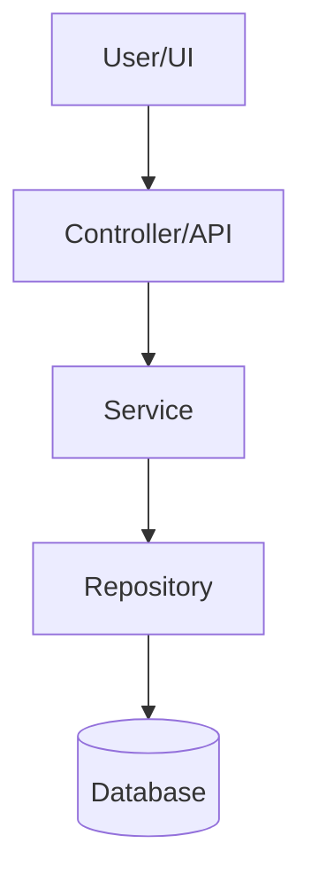

# Design Document Template

## Purpose

Use this template after `requirements.md` or `bugfix.md` exists. The design document turns desired behavior into an implementable technical and UX blueprint.

A design document must explain what to build, why the chosen approach is correct, how data/state/API/UI pieces fit together, and how correctness will be verified.

## Spec Pattern

Design docs use:

- Overview
- Key Design Decisions
- Architecture
- Components and Interfaces
- Data Models
- State Machine, when applicable
- API Contracts, when applicable
- Correctness Properties
- Error Handling
- Testing Strategy

Correctness properties are first-class. They describe invariants that should hold across broad input domains, then link back to requirements.

## General Design Constraints

- Schema first when backend data changes are involved
- Controller → Service → Repository layering when the architecture uses layered backend boundaries
- Business logic in service layer only
- RBAC enforced at API boundary when authorization is involved
- Frontend reflects backend state only
- Meaningful state changes include audit logging when auditability is required
- Approvable entities include `status`, `approvedBy`, `approvedAt` when approval workflows are involved
- Approval actions show what is being approved and who is recorded as owner
- No hidden automation
- Reuse existing design system components before creating new ones

## Template

```md
# Design Document: [Feature / Fix Name]

## Overview

[Summarize the design.]

This design implements [capability/fix] by changing [main components]. The approach is intentionally [minimal/backend-first/schema-first/UI-only/etc.] and preserves [important constraints].

### Key Design Decisions

| Decision | Rationale |
|----------|-----------|
| [Decision 1] | [Why this choice is correct] |
| [Decision 2] | [Why this choice is correct] |
| [Decision 3] | [Why this choice is correct] |

## Architecture



## Components and Interfaces

### [Component/Service Name]

Responsibility:

- [Responsibility 1]
- [Responsibility 2]

Interface:

```typescript
interface [Name] {
  [method](input: [Type]): Promise<[Result]>;
}
```

## Data Models

### Existing Model Changes

| Field | Type | Purpose |
|-------|------|---------|
| `[field]` | `[type]` | [purpose] |

### New Model

```typescript
interface [ModelName] {
  id: string;
}
```

## State Model

### States

| State | Meaning |
|-------|---------|
| `[state]` | [meaning] |

### Allowed Transitions

| From | To | Trigger | Side Effects |
|------|----|---------|--------------|
| `[from]` | `[to]` | [trigger] | [side effects] |

### Forbidden Transitions

- `[from]` → `[to]`: [reason]
- `[from]` → `[to]`: [reason]

## API Contracts

| Method | Path | Description | Roles | Side Effects |
|--------|------|-------------|-------|--------------|
| GET | `/path` | [description] | [roles] | [side effects] |
| POST | `/path` | [description] | [roles] | [side effects] |

### Request Schema

```typescript
const requestSchema = z.object({
  field: z.string(),
});
```

### Response Shape

```typescript
interface ResponseShape {
  data: unknown;
}
```

## Frontend Design

### Component Tree

```text
<PageName>
  ├── <ComponentA> — [responsibility]
  ├── <ComponentB> — [responsibility]
  └── <ComponentC> — [responsibility]
```

### State Management

| Query/Mutation | Key | Purpose | Invalidation |
|----------------|-----|---------|--------------|
| [Query] | [Key] | [Purpose] | [Invalidation] |

### UI States

- [ ] Loading — skeleton loaders
- [ ] Empty — explains what this area is for, why it is empty, and what to do next
- [ ] Populated / success
- [ ] Validation error
- [ ] API error
- [ ] Unauthorized / forbidden

## Correctness Properties

### Property 1: [Property Name]

_For any_ [input/domain], THE [component/service] SHALL [invariant].

**Validates: Requirements [x.y, x.z]**

### Property 2: [Property Name]

_For any_ [input/domain], IF [condition], THEN THE [component/service] SHALL [expected behavior].

**Validates: Requirements [x.y]**

## Error Handling

| Scenario | HTTP Status / UI Handling | Error Code | Description |
|----------|---------------------------|------------|-------------|
| [Scenario] | [Status/Handling] | `[CODE]` | [Description] |

## Testing Strategy

### Unit Tests

| Test Area | What to Verify |
|----------|----------------|
| [Area] | [Expected behavior] |

### Integration Tests

| Flow | What to Verify |
|------|----------------|
| [Flow] | [Expected behavior] |

### Property-Based Tests

Use property-based tests when the feature includes:

- state machines
- parsers/serializers
- permission matrices
- version calculations
- workflow transitions
- invariants across broad input domains

Do not use property-based tests when the change is mostly static UI composition.

## Alternatives Considered

| Alternative | Why Rejected |
|-------------|--------------|
| [Alternative] | [Reason] |
```

## Quality Gate

Before saving `design.md`, confirm:

- [ ] Design decisions are explicit
- [ ] Architecture and layering are clear
- [ ] Data model includes ownership and audit fields where applicable
- [ ] API contracts include roles, side effects, and errors
- [ ] State machine lists allowed and forbidden transitions where applicable
- [ ] Correctness properties validate requirements
- [ ] Testing strategy matches the feature type
- [ ] No business logic is placed in controller or UI
- [ ] Frontend reflects backend state
